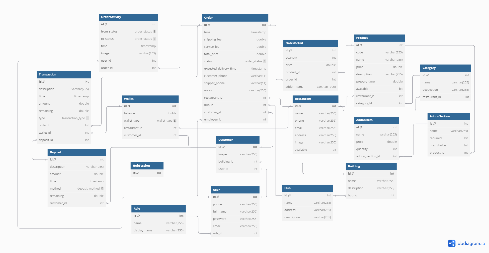
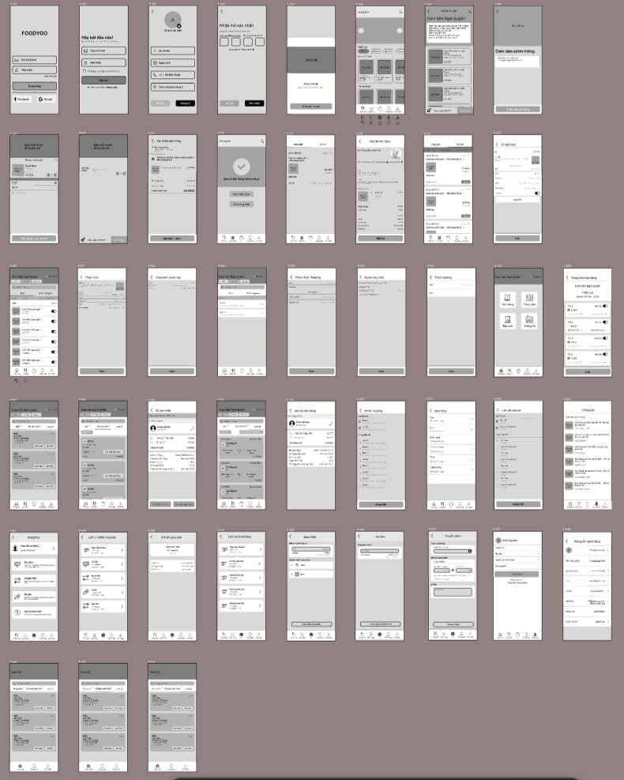

# FoodyGo

FoodyGo is a platform designed to enhance food delivery efficiency and security for students residing in dormitory area B. It connects students, local restaurants, and delivery staff through a streamlined system featuring fixed delivery hubs.

## Table of Contents
- [Context](#context)
- [Problem Statement](#problem-statement)
- [Solution Overview](#solution-overview)
- [Target Users](#target-users)
- [Features](#features)
  - [Customer Features](#customer-features)
  - [Vendor Features](#vendor-features)
  - [Hub Staff Features](#hub-staff-features)
  - [Manager Features](#manager-features)
  - [Admin Features](#admin-features)
- [Entity Relationship Diagram](#entity-relationship-diagram)
- [Figma Design](#figma-design)
- [Reference](#reference)

---

## Context
- Target location: Dormitory area B.
- Students frequently order food from various local restaurants.

## Problem Statement
- Lack of a convenient & professional ordering platform
- Inefficiencies in the delivery process
- Limited customer reach for restaurants

## Solution Overview
- Online food ordering system
- Hub-based delivery model – Reducing waiting time and optimizing efficiency
- Enhancing the experience for restaurants
- Efficient management system for Admin & Manager

## Target Users
1. Students living in dormitories.
2. Restaurant owners near the dormitory area.

---

## Features

### Customer Features
- **Account Management**:
  - Register
  - Log in
  - Update personal details.
- **Food Ordering**:
  - View restaurants
  - View food items
  - Place an order
- **Payments**:
  - Choose payment methods.
  - Use online payment gateways (e.g., VNPay).
- **Order Tracking**:
  - Track order status
  - Receive order status notifications

### Seller Features
- **Menu Management**:
  - View food item information
  - Update food item information
  - Open/Close food sales
- **Store Management**:
  - View restaurant information
  - Update restaurant status
- **Order Management**:
  - Monitor order statuses.
  - Receive notifications for new orders.
- **Track and analyze order statistics and revenue**:

### Hub Staff Features
- **Hub Order Management**:
  - View order status
  - Update order status

### Manager Features
- **Hub Management**:
  - View Hub information
  - Update Hub information
- **Store Management**:
  - Access restaurant information.
- **Order Tracking**:
  - Monitor order statuses.
- **Revenue Management**:
  - Track payment transactions
  - Monitor reports and revenue statistics
  
### Admin Features
- **User Account Management**:
  - View user details.
  - Update account statuses (e.g., lock, deactivate).
- **Statistics & Reports**:
  - Track reports
  - Monitor statistics on traffic and user activity

---

## Entity Relationship Diagram

---

## Figma Design

---

## Reference
- [ShoppeFood](https://shopeefood.vn)
- [GrabFood](https://www.grab.com/vn/food)

---

## License
[MIT License](LICENSE)
